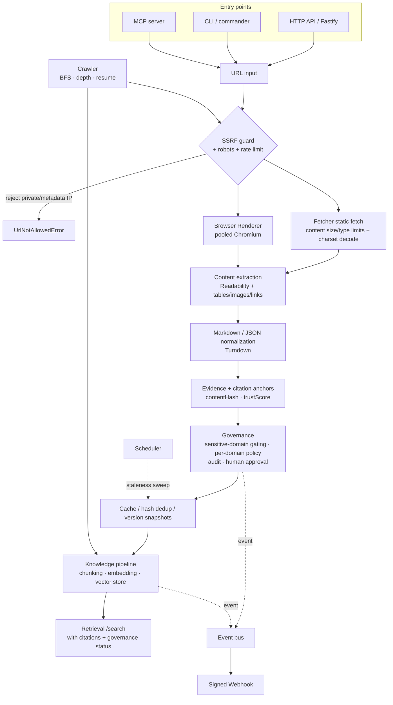

**English** | [简体中文](ARCHITECTURE.zh-CN.md)

# Octopus Scout — Architecture & Technical Notes

> Octoryn Web Ingestion Engine — a **governable, auditable, AI-native** pipeline for ingesting web pages / PDFs / documents.
>
> Version snapshot: 9 iterations complete. 53 source files / ~11.2k lines of TypeScript, 39 test files, **246 tests passing + 6 key/DB-gated integration tests (skipped on demand)**, zero errors under `tsc` strict mode, production build (`tsc` emit, including `.d.ts`) passing.

---

## 1. Positioning

Firecrawl positions itself as **"turning web pages into LLM-ready Markdown."** Octopus Scout goes one step further:

> **"Let web content enter a governable knowledge system in a controlled way."**

The difference isn't "how aggressively you crawl," but **what happens after content comes in**: every piece of content carries evidence anchors, a trust score, governance decisions, and version snapshots, and can be retrieved, audited, approved, retention-cleaned, and used to trigger notifications. The first version deliberately focuses on the "normal 80% of websites" and does not compete head-on on anti-bot / stealth / proxy pools.

### Design Principles

1. **Degrade gracefully** — when Redis/Postgres/API keys are absent, it automatically falls back to embedded SQLite / in-memory / deterministic stubs, and never throws during import. A single machine with zero dependencies (clone-and-run) can run the full pipeline.
2. **Secure by default** — SSRF protection, content size/type limits, robots compliance, and sensitive-domain gating are on by default.
3. **Governance-first** — trust scoring, audit trails, human approval, and per-domain policies are first-class citizens, not afterthoughts.
4. **Pluggable backends** — storage / vector store / embedding / rate limiting are all interfaces + multiple implementations (SQLite ↔ File ↔ Postgres, stub ↔ Voyage/OpenAI, in-memory ↔ Redis).
5. **Shared core across entry points** — the HTTP API, CLI, and MCP server share the same pipeline and behave consistently.

---

## 2. System Architecture

### Module Map (`src/`)

| Layer                   | Files                                                                          | Responsibility                                                                                      |
| ----------------------- | ------------------------------------------------------------------------------ | --------------------------------------------------------------------------------------------------- |
| **Entry points**        | `server.ts` · `cli.ts` · `mcp.ts`                                              | Fastify HTTP / commander CLI / MCP stdio — all three reuse the same pipeline                        |
| **Fetching**            | `fetcher/httpFetcher.ts` · `browser/browserPool.ts`                            | Static fetch (with SSRF/limits/rate limiting) / pooled Playwright rendering                         |
| **Security**            | `fetcher/urlGuard.ts` · `fetcher/content.ts` · `auth.ts`                       | SSRF guard / content size·type·charset / API-key authentication                                     |
| **Politeness**          | `fetcher/robots.ts` · `fetcher/rateLimiter.ts`                                 | robots.txt + crawl-delay / distributed per-domain rate limiting                                     |
| **Crawling**            | `crawl/crawler.ts` · `crawl/crawlStore.ts`                                     | BFS depth crawl + sitemap seeds + filtering / job persistence and resumable crawls                  |
| **Extraction**          | `extract/*` · `sitemap.ts`                                                     | Readability main content, tables, images, HTML→MD, PDF→MD / sitemap parsing                         |
| **Evidence/Governance** | `evidence/evidenceBuilder.ts` · `governance/*`                                 | Citation anchors·trust score / audit·approval·per-domain policy                                     |
| **Storage**             | `storage/sqlite.ts` · `storage/snapshotStore.ts` · `storage/retention.ts`      | Shared SQLite connection / snapshot·dedup·versions (SQLite default · File · PG) / retention cleanup |
| **Knowledge**           | `knowledge/{chunking,embedding,ragExport,vectorStore,retrieval,siteIngest}.ts` | Chunking · embedding · RAG export · vector store · retrieval · whole-site ingest                    |
| **Events/Automation**   | `events/{eventBus,webhooks}.ts` · `schedule/scheduler.ts`                      | Event bus / signed webhooks / scheduled refresh                                                     |
| **Queue**               | `queue/scrapeQueue.ts` · `worker.ts`                                           | BullMQ scrape/crawl queue + dead-letter queue + failure classification                              |
| **Observability**       | `metrics.ts` · `health.ts`                                                     | Counter metrics (JSON/Prometheus) / readiness probe                                                 |
| **Foundation**          | `config.ts` · `types.ts` · `utils/*`                                           | zod config / shared types / url·hash utilities                                                      |

---

## 3. Tech Stack

- **Runtime**: Node ≥ 22, TypeScript (ESM / NodeNext, `strict`)
- **HTTP**: Fastify + `@fastify/cors`
- **Browser**: Playwright (Chromium, pooled)
- **Extraction**: `@mozilla/readability` + `jsdom`, `turndown` (HTML→MD), `pdf-parse` (PDF→MD/tables)
- **Queue**: BullMQ + Redis (optional)
- **Storage**: embedded SQLite (`better-sqlite3`, default, single-file zero-dependency) / local JSON files (`file` fallback) / PostgreSQL + pgvector (optional, set `DATABASE_URL`)
- **Rate limiting/event locks**: `ioredis` (optional) / in-process (default)
- **embedding**: Voyage / OpenAI (with key) / deterministic stub (default, offline)
- **Validation**: `zod` (all external input is parsed at the boundary)
- **MCP**: `@modelcontextprotocol/sdk`
- **Testing**: Vitest (hermetic, local http fixtures, temp directories)
- **Deployment**: Docker + docker-compose (api / worker / redis / postgres)

---

## 4. End-to-End Data Flow (using `/scrape` as an example)

1. **Normalization + SSRF guard**: `normalizeUrl` → `assertUrlAllowed` (rejects non-http(s), and hosts whose resolved IP lands in private/loopback/link-local/metadata ranges, guarding against DNS rebinding).
2. **Cache hit check**: within TTL and with compatible request shape → return the snapshot directly.
3. **robots + rate limiting**: `canFetchUrl` (also feeds the robots `crawl-delay` to the rate limiter); `waitForDomainSlot` queues per domain (including per-domain policy overrides).
4. **Fetching**: static `fetch` (`content-length` precheck → type allowlist → streamed capped read → charset decoding), or pooled browser rendering after an `auto` determination.
5. **Extraction**: Readability extracts main content → Turndown converts to Markdown; additionally extracts tables/images (alt/caption)/links; PDFs go through `pdf-parse`.
6. **Evidence**: `contentHash = sha256(markdown)`, per-paragraph `CitationAnchor` (with character offsets), `trustScore` (https/gov-edu/canonical/metadata/length).
7. **Governance**: sensitive keywords → `requires_approval`; `applyPolicy` layers on the per-domain policy (escalate only, never downgrade) + trust overrides.
8. **Dedup + persistence**: `findByHash` hit → reuse the old snapshot (`cache.dedup`); otherwise `save` a new version.
9. **Side effects (best-effort)**: write the audit event; if `requires_approval` and not a duplicate → create a pending approval; `emitEvent` → webhook; `recordX` increments metrics.

`/crawl` wraps a BFS frontier on the outside (depth, concurrency, same-origin/regex filtering, sitemap seeds, checkpoint to `crawlStore` every N pages to support resumable crawls), with each URL reusing the `scrapeUrl` above. `/ingest` / `/ingest-site` append the **chunk → embedding → vector store** write path after scraping; `/search` runs the **query embedding → vector retrieval → return with citations** read path.

---

## 5. Key Data Models (`src/types.ts`)

- **`ScrapeResult`** — `{ request, fetch, extraction, evidence, cache:{hit, snapshotId, dedup} }`, the complete result of a single scrape.
- **`EvidenceBundle`** — `{ contentHash, anchors:CitationAnchor[], trust:SourceTrustScore, governance:GovernanceDecision, capturedAt }`, the auditable "evidence."
- **`CitationAnchor`** — `{ id, sourceUrl, textQuote, markdownOffset }`, pins each piece of text back to the source to support citations.
- **`GovernanceDecision`** — `{ status: allowed|blocked|requires_approval, reasons[], policyVersion }`.
- **`SnapshotRecord` / `SnapshotSummary`** — version snapshots (history retained per url, queryable via `listVersionsByUrl`).
- **`Chunk` / `StoredChunk`** — chunks (headingPath, charStart/End, anchorId) / stored vector entries (including embedding, trustScore, governanceStatus).
- **`VectorSearchHit` / `VectorSearchResult`** — retrieval results with score + source + citation anchors + governance status.
- **`AuditEvent` / `ApprovalRecord`** — append-only audit trail / approval tickets.
- **`CrawlJobState` / `CrawlJobSummary`** — resumable crawler job state (frontier, visited, pages).
- **`ScoutEvent` / `WebhookDelivery`** — internal events / webhook delivery records.
- **`MetricsSnapshot` / `ReadinessReport` / `RetentionReport` / `StalenessSweepResult`** — operational data structures.

---

## 6. Interface Surface

**HTTP (30 routes, Fastify)**

| Group          | Endpoints                                                                                                                                                                                 |
| -------------- | ----------------------------------------------------------------------------------------------------------------------------------------------------------------------------------------- |
| Scraping       | `POST /scrape` `/fetch` `/render` `/sitemap` `/crawl` `/jobs/scrape` `/jobs/crawl` `GET /crawls` `/crawls/:id`                                                                            |
| Knowledge      | `POST /export` `/ingest` `/ingest-site` `/search` `GET /versions?url=` `/snapshots/:id`                                                                                                   |
| Governance/Ops | `GET /governance/approvals[/:id]` `POST /governance/approvals/:id/decision` `GET /audit` `POST /admin/retention` `/admin/refresh` `GET /events` `/webhooks` `/metrics` `/ready` `/health` |

**CLI (18 commands)**: `scrape` `fetch` `render` `sitemap` `map` `crawl` `crawls` `export` `ingest` `ingest-site` `search` `extract` `retention` `refresh` `job` `approvals` `approve` `reject`

**MCP (8 tools)**: `octoryn_scrape` `octoryn_crawl` `octoryn_map` `octoryn_export` `octoryn_ingest` `octoryn_ingest_site` `octoryn_search` `octoryn_extract`

Authentication: `authMode=write` protects all write requests + `/governance` `/audit` `/admin`; `all` protects everything except `GET /health`.

---

## 7. What Was Built · What Was Achieved · What Was Solved

Organized by five iterations (each independently re-run + tested end-to-end against real sites):

### R1 — Backbone Completion

**Built**: depth crawl (BFS/sitemap seeds/filtering), RAG export (chunking + citations + JSONL), content-hash dedup, version snapshots, governance audit + human approval, pooled browser, distributed rate limiting, dead-letter queue + failure classification.
**Solved**: grew "single-page to Markdown" into a pipeline that is "batchable, dedupable, version-traceable, and attributable on fetch failure."

### R2 — Closing the RAG Retrieval Loop

**Built**: real embeddings (Voyage/OpenAI + stub fallback), vector store (File cosine / PG jsonb), `/ingest`+`/search`, per-domain governance policies, API-key authentication.
**Achieved**: the complete RAG read/write loop of `scrape → governance → chunk → embedding → vector store → retrieval with citations`.
**Solved**: Firecrawl only gives you Markdown, and you have to build the vector store yourself; here retrieval is **built in**, working out of the box.

### R3 — Security & Robustness Hardening

**Built**: SSRF guard (inspects the resolved IP, guards against rebinding), content size/type limits + charset decoding, robots crawl-delay integration, `/metrics`+`/ready`.
**Solved**: the most fatal holes in a service that accepts arbitrary URLs — **SSRF** (hitting internal networks / cloud metadata) and **resource exhaustion** (oversized responses) — are plugged by default.

### R4 — Scaling Knowledge-Base Operations

**Built**: whole-site ingest (crawl→index), resumable crawls (persisted frontier), retention cleanup for versions/audit/approvals.
**Solved**: large sites interrupted mid-crawl can be resumed; unbounded growth of snapshots/audit can be governed.

### R5 — Eventing & Automation

**Built**: internal event bus, HMAC-signed webhooks (retries + delivery logs), scheduled staleness refresh.
**Achieved**: an `approval.requested` event can page the approver directly via webhook — **human-in-the-loop governance is upgraded from "wait in a queue for someone to look" to "proactive notification"**; the knowledge base can auto-refresh.

### Problems Solved Across the Board

- **Auditable**: every scrape/approval/decision goes into the append-only audit trail.
- **Governable**: trust scoring + sensitive-domain gating + per-domain policies + human approval; medical/legal/financial content requires approval by default.
- **Citable**: every chunk is pinned back to source anchors and character offsets, so RAG answers are traceable.
- **Operable**: metrics, readiness probe, retention cleanup, dead-letter queue, resumable crawls.
- **Zero-dependency start**: the full pipeline runs on a single machine without Redis/PG/keys.

---

## 8. Benchmarking Against Firecrawl

> Stance: an honest comparison. Firecrawl is a mature managed scraping platform with a clear lead on **scraping capability and scale**; Octopus Scout is a self-hosted MVP whose direction — **governance and knowledge-system integration** — is one Firecrawl does not cover. The two have different goals.

### Capability Comparison

| Dimension                                                              | Firecrawl                               | Octopus Scout                                                                                                                  |
| ---------------------------------------------------------------------- | --------------------------------------- | ------------------------------------------------------------------------------------------------------------------------------ |
| Single-page scrape → Markdown                                          | ✅ Mature                               | ✅                                                                                                                             |
| Dynamic rendering (JS)                                                 | ✅                                      | ✅ Playwright pooled                                                                                                           |
| Whole-site crawl                                                       | ✅ `/crawl`                             | ✅ BFS + **resumable crawls**                                                                                                  |
| Fast URL discovery                                                     | ✅ `/map`                               | ✅ `POST /map` (sitemap + root-page links + filtering)                                                                         |
| PDF / tables                                                           | ✅                                      | ✅                                                                                                                             |
| **Stealth**                                                            | ✅ Strong                               | ✅ stealth-plus (zero-dependency hand-rolled: webdriver/plugins/window.chrome/WebGL spoofing + UA-CH + hidden automation flag) |
| **Proxy**                                                              | ✅ Managed proxy pool                   | ⚠️ **BYO proxy** (rotation + hand-rolled CONNECT tunnel, zero-dependency); **no managed proxy pool** (deliberately not built)  |
| **JS challenges (Cloudflare, etc.)**                                   | ✅                                      | ✅ detection + browser waits out and self-solves the challenge (non-CAPTCHA type)                                              |
| **CAPTCHA solving**                                                    | ✅                                      | ⚠️ seam + Noop placeholder only (TODO); solving requires an external service (deliberately not built in)                       |
| **Adversarial anti-bot / top-tier bot protection**                     | ✅ **Core moat**                        | ❌ Not guaranteed (deliberately avoids the adversarial arms race)                                                              |
| Pre-scrape interaction (actions: click/scroll/type)                    | ✅                                      | ✅ `actions` (wait/waitForSelector/click/scroll/type/press/screenshot)                                                         |
| LLM structured extraction (`/extract` + schema)                        | ✅                                      | ✅ `POST /extract` (Anthropic SDK / OpenAI, schema-constrained; OpenAI live-verified)                                          |
| Hybrid retrieval (vector + keyword + rerank)                           | ⚠️ Depends on your own build            | ✅ vector/lexical/**hybrid(RRF)** + pluggable rerank                                                                           |
| Built-in embedding + vector retrieval                                  | ❌ (outputs Markdown, BYO vector store) | ✅ **built in** `/ingest`+`/search` (pgvector / file cosine)                                                                   |
| Direct agent connection (MCP)                                          | ⚠️ Third-party wrappers                 | ✅ Native MCP server (Claude + Codex config ready)                                                                             |
| Citation anchors / evidence bundle                                     | ❌                                      | ✅ Every chunk links back to source                                                                                            |
| Trust scoring / source policy                                          | ❌                                      | ✅ trustScore + per-domain policy                                                                                              |
| **Governance: audit trail / human approval / sensitive-domain gating** | ❌                                      | ✅ **Core differentiator**                                                                                                     |
| Content-hash dedup + version snapshots                                 | ⚠️ change-tracking                      | ✅ dedup + version-history queries                                                                                             |
| SSRF protection (built-in, default)                                    | — (handled on the managed side)         | ✅ Built in, on by default                                                                                                     |
| Events / signed webhooks                                               | ⚠️ Partial (crawl webhook)              | ✅ General event bus + HMAC signing                                                                                            |
| Scheduled refresh / retention cleanup                                  | ⚠️                                      | ✅ staleness sweep + retention                                                                                                 |
| Authentication                                                         | ✅ API key (managed)                    | ✅ API key (self-hosted, tiered)                                                                                               |
| Scale / stability                                                      | ✅ Managed, battle-tested               | ⚠️ MVP; queue-ready but no large-scale load testing                                                                            |
| Deployment                                                             | Managed SaaS + self-hosted open source  | Self-hosted (Docker Compose)                                                                                                   |
| SDK / ecosystem                                                        | ✅ Rich                                 | ⚠️ HTTP + CLI + MCP                                                                                                            |

### One-Line Summary

- **To turn arbitrary websites (including those with strong anti-bot) into Markdown at scale with low operational overhead** → Firecrawl is the better fit.
- **To bring web content into a self-hosted, auditable, cited, approvable knowledge system with built-in retrieval** (especially for compliance-sensitive scenarios like medical/legal/financial) → Octopus Scout provides the governance and knowledge layers Firecrawl does not cover.

### Key Trade-offs (revised after R9)

Early versions avoided anti-bot entirely; from R9 onward a **zero-dependency, open-source, self-hosted** layer was added: stealth-plus (hand-rolled anti-detection) + BYO proxy (including a hand-rolled CONNECT tunnel) + Cloudflare JS challenge waiting + a pluggable `FetchProvider` seam. **Deliberately stops short of**: managed proxy pools, CAPTCHA solving, and the arms race of adversarial bot protection — these either require paid infrastructure / external services or are a never-converging maintenance burden, conflicting with the "zero-dependency, auditable, testable" orientation; both CAPTCHA and external fetch backends leave a seam, so you can plug in a BYO key or third party when needed.

Honest positioning: **completeness has been substantially filled in (no longer "missing a piece"), but top-tier bot protection / CAPTCHA sites are not guaranteed**. This is a deliberate boundary, not an oversight — see the discussion in the conversation logs on "why not do adversarial anti-bot." `FetchProvider` turns "plug a professional scraping backend into hard targets" from an architectural idea into a one-line config, while the governance/evidence/retrieval layers always remain your own.

---

## 9. Verification Status (honestly labeled)

| Item                                                  | Status                                                                                                                                                                                              |
| ----------------------------------------------------- | --------------------------------------------------------------------------------------------------------------------------------------------------------------------------------------------------- |
| `tsc --noEmit` + production `tsc` emit                | ✅ Zero errors                                                                                                                                                                                      |
| Unit/integration tests                                | ✅ 158 passing + 3 key-gated (on demand) / 25 files, stable across re-runs                                                                                                                          |
| End-to-end tests (real sites + local fixtures)        | ✅ scrape/dedup/governance, crawl, resume, whole-site ingest, search, SSRF blocking, signed webhook, metrics, staleness sweep                                                                       |
| **Real embedding (OpenAI) live verification**         | ✅ 1536 dimensions, semantic retrieval effective (top-5 all hit the target topic). **Voyage is code-only, never run with a real key.**                                                              |
| **pgvector (real container)**                         | ✅ `vector(256)` + HNSW cosine, ingest→search works; fixed a real bug where the search-only process returned 0 hits due to in-memory `tableReady` early-exit (includes a DB-gated regression test). |
| **Persistent queue (real Redis)**                     | ✅ `/jobs/ingest-site` enqueued → worker processed → `/jobs/:id` returns `completed`.                                                                                                               |
| **Distributed lock (real Redis)**                     | ✅ Concurrent on the same key: only one acquires, the other gets `acquired:false`; reacquirable after release; degrades when no Redis.                                                              |
| **MCP (built bin)**                                   | ✅ `tools/list` from `node dist/mcp.js` returns all tools.                                                                                                                                          |
| **Hybrid retrieval (offline)**                        | ✅ Compared vector/lexical/hybrid under stub vectors: BM25 hits chunks containing the keyword, RRF fusion scores match expectations, heuristic rerank deterministic.                                |
| **LLM structured extraction (OpenAI live)**           | ✅ `gpt-4o-mini` extracts the Espresso page per JSON Schema → compliant JSON. **The Anthropic path is implemented with the official SDK, but not live-verified without an Anthropic key.**          |
| **/map (real site)**                                  | ✅ quotes.toscrape.com discovered 48 URLs, search filtering effective.                                                                                                                              |
| **Pre-scrape actions (real chromium)**                | ✅ click runs runtime JS → a runtime-only marker appears in the DOM; the screenshot action produces a screenshot.                                                                                   |
| **stealth (real chromium)**                           | ✅ OFF=OctorynScout UA + webdriver:true; ON=real Chrome UA + webdriver:undefined.                                                                                                                   |
| **stealth-plus (real chromium, R9)**                  | ✅ In-page verified: webdriver=false, window.chrome present, plugins=5, languages=[en-US,en], WebGL vendor=Intel Inc., hwc=8. Hand-rolled, zero-dependency.                                         |
| **proxiedFetch CONNECT tunnel (R9)**                  | ✅ Local CONNECT proxy → tunnel to real https://example.com → TLS → 200/559 bytes/"Example Domain". Zero-dependency (node:net/tls).                                                                 |
| **Zero new dependencies (R9)**                        | ✅ The anti-bot module only imports node:/playwright/local; the package.json deps count did not increase due to R9.                                                                                 |
| Large-scale load testing / multi-instance concurrency | ❌ Not done                                                                                                                                                                                         |
| Real-site anti-bot adversarial testing                | ❌ Out of scope                                                                                                                                                                                     |

---

## 10. Limitations & Roadmap

**Three storage tiers (as of latest)**

- **Embedded SQLite (default)** — `storage/sqlite.ts` manages a single `octopus-scout.db` (WAL, shared connection, FTS5 full-text). All five store families (snapshot · crawl · vector · lexical · governance/audit+approvals) have SQLite implementations, **field-for-field parity** with the File backend. Zero external dependencies, clone-and-run.
- **File (`OCTORYN_SCOUT_STORAGE_BACKEND=file`)** — plain JSON file fallback, convenient for manual inspection / debugging.
- **Postgres + pgvector (set `DATABASE_URL`)** — large-scale corpora / multi-instance deployment; `vector(dim)` + HNSW cosine.
- Selection logic: `resolveStorageBackend()` — with `DATABASE_URL`, use Postgres; with `backend=file`, use File; otherwise (`auto`/`sqlite`), use SQLite.

**Already solved in R6** (live-verified, see below)

- ✅ site-ingest can run as a **BullMQ persistent job** (`/jobs/ingest-site` + `/jobs/:id`), with failures going to the dead-letter queue.
- ✅ The scheduler gained a **Redis distributed lock** (`SET NX PX` + Lua compare-del), so multiple instances don't sweep redundantly; with no Redis it runs anyway as a single instance.
- ✅ **pgvector** backend (`vector(dim)` + HNSW cosine `<=>`), falling back to jsonb when the extension is unavailable.
- ✅ **MCP server packaged for Claude / Codex**: `octopus-scout-mcp` bin + `docs/mcp/` config + `docs/MCP.md`.

**Current limitations (as of R9 + quality review)**

- The pgvector column dimension is locked to the vector length on the first upsert (switching embedding providers requires rebuilding the table).
- Not live-verified (requires external keys/resources): Voyage embedding, Anthropic extraction, Cohere/Voyage rerank, large-scale load testing.
- `proxiedFetch` has only a socket idle timeout (no absolute deadline), and chunk decoding is O(n²) — known DoS-resilience weaknesses (punch-list).
- ESLint not yet integrated (Prettier + CI typecheck/test/format already added); the HTTP route layer and core `scrapeUrl` lack dedicated tests (service functions are well covered); no coverage threshold.
- Anti-bot: only stealth-plus + BYO proxy + JS challenge waiting; **top-tier bot protection / CAPTCHA solving not guaranteed** (deliberate, see §8 and docs/CAPTCHA.md).

**Suggested Roadmap**

1. **Ecosystem**: TypeScript/Python SDK; LangChain/LlamaIndex retriever adapters.
2. **Extraction enhancements**: multi-page/whole-site schema extraction; store extraction results.
3. **Retrieval enhancements**: rerank live verification (requires key); query rewriting / HyDE.
4. **Quality fill-in**: integrate ESLint + a one-time lint cleanup; HTTP route-layer tests (`app.inject`) + dedicated `scrapeUrl` tests + a coverage threshold; `proxiedFetch` absolute timeout + incremental chunk decoding.
5. **Anthropic extraction live verification** (requires an Anthropic key).

---

_This document corresponds to the 5-iteration version of the implementation as of 2026-06-30. If work continues, please keep sections 7, 9, and 10 of this document in sync._
