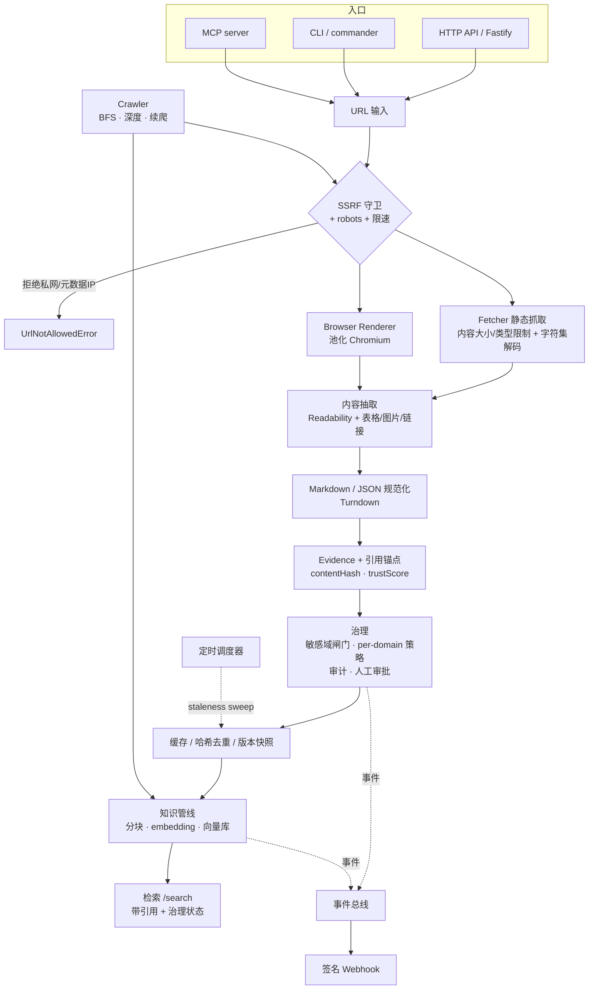

[English](ARCHITECTURE.md) | **简体中文**

# Octopus Scout — 架构与技术说明

> Octoryn Web Ingestion Engine — 一个**可治理、可审计、AI-native** 的网页/PDF/文档摄取管道。
>
> 版本快照：9 轮迭代完成。53 个源文件 / ~11.2k 行 TypeScript，39 个测试文件，**246 测试通过 + 6 个 key/DB-gated 集成测试（按需 skip）**，`tsc` 严格模式零错误，生产构建（`tsc` emit，含 `.d.ts`）通过。

---

## 1. 定位

Firecrawl 的定位是 **“把网页变成 LLM-ready 的 Markdown”**。Octopus Scout 的定位更进一步：

> **“让网页内容受控地进入一个可治理的知识系统。”**

差异不在“抓得多猛”，而在**抓进来之后**：每一份内容都带着证据锚点、信任评分、治理决策、版本快照，可被检索、可被审计、可被审批、可被保留清理、可触发通知。第一版有意聚焦“正常的 80% 网站”，不与反爬/隐身/代理池正面竞争。

### 设计原则

1. **优雅降级（degrade gracefully）** —— 没有 Redis/Postgres/API key 时，自动回落到内嵌 SQLite / 内存 / 确定性 stub，永不在 import 期抛错。单机零依赖（clone-and-run）即可跑通全链路。
2. **安全默认（secure by default）** —— SSRF 防护、内容大小/类型上限、robots 尊重、敏感域闸门默认开启。
3. **治理优先（governance-first）** —— 信任评分、审计流水、人工审批、per-domain 策略是一等公民，而非事后补丁。
4. **可插拔后端** —— 存储/向量库/embedding/限速 都是接口 + 多实现（SQLite ↔ File ↔ Postgres，stub ↔ Voyage/OpenAI，内存 ↔ Redis）。
5. **多入口同源** —— HTTP API、CLI、MCP server 共享同一条管道，行为一致。

---

## 2. 系统架构

### 模块映射（`src/`）

| 层              | 文件                                                                                                     | 职责                                                                                                    |
| --------------- | -------------------------------------------------------------------------------------------------------- | ------------------------------------------------------------------------------------------------------- |
| **入口**        | `server.ts` · `cli.ts` · `mcp.ts`                                                                        | Fastify HTTP / commander CLI / MCP stdio，三者复用同一管道                                              |
| **抓取**        | `fetcher/httpFetcher.ts` · `browser/browserPool.ts`                                                      | 静态 fetch（带 SSRF/限制/限速）/ 池化 Playwright 渲染                                                   |
| **安全**        | `fetcher/urlGuard.ts` · `fetcher/content.ts` · `auth.ts`                                                 | SSRF 守卫 / 内容大小·类型·字符集 / API-key 鉴权                                                         |
| **礼貌**        | `fetcher/robots.ts` · `fetcher/rateLimiter.ts`                                                           | robots.txt + crawl-delay / 分布式 per-domain 限速                                                       |
| **爬取**        | `crawl/crawler.ts` · `crawl/crawlStore.ts`                                                               | BFS 深度爬 + sitemap 种子 + 过滤 / 任务持久化与续爬                                                     |
| **抽取**        | `extract/*` · `sitemap.ts`                                                                               | Readability 正文、表格、图片、HTML→MD、PDF→MD / sitemap 解析                                            |
| **证据/治理**   | `evidence/evidenceBuilder.ts` · `governance/*`                                                           | 引用锚点·信任分 / 审计·审批·per-domain 策略                                                             |
| **存储**        | `storage/sqlite.ts` · `storage/snapshotStore.ts` · `extract/extractionStore.ts` · `storage/retention.ts` | 共享 SQLite 连接 / 快照·去重·版本 / 受治理的抽取存储——均为 SQLite 默认 · File · PG / 保留清理           |
| **知识**        | `knowledge/{chunking,embedding,ragExport,vectorStore,retrieval,siteIngest}.ts` · `integrations.ts`       | 分块 · embedding · RAG 导出 · 向量库 · 检索（+ 启发式查询改写）· 整站入库 · 框架无关的 retriever 适配器 |
| **LLM 抽取**    | `extract/{llmExtract,extractMulti,extractionStore}.ts`                                                   | 单 URL LLM 抽取 · 多 URL / 整站抽取 · 抽取结果的受治理持久化                                            |
| **事件/自动化** | `events/{eventBus,webhooks}.ts` · `schedule/scheduler.ts`                                                | 事件总线 / 签名 webhook / 定时刷新                                                                      |
| **队列**        | `queue/scrapeQueue.ts` · `worker.ts`                                                                     | BullMQ scrape/crawl 队列 + 死信队列 + 失败分类                                                          |
| **可观测**      | `metrics.ts` · `health.ts`                                                                               | 计数指标（JSON/Prometheus）/ 就绪探针                                                                   |
| **基础**        | `config.ts` · `types.ts` · `utils/*`                                                                     | zod 配置 / 共享类型 / url·hash 工具                                                                     |

---

## 3. 技术栈

- **运行时**：Node ≥ 22，TypeScript（ESM / NodeNext，`strict`）
- **HTTP**：Fastify + `@fastify/cors`
- **浏览器**：Playwright（Chromium，池化）
- **抽取**：`@mozilla/readability` + `jsdom`，`turndown`（HTML→MD），`pdf-parse`（PDF→MD/表格）
- **队列**：BullMQ + Redis（可选）
- **存储**：内嵌 SQLite（`better-sqlite3`，默认，单文件零依赖）/ 本地 JSON 文件（`file` 回落）/ PostgreSQL + pgvector（可选，设 `DATABASE_URL`）
- **限速/事件锁**：`ioredis`（可选）/ 进程内（默认）
- **embedding**：Voyage / OpenAI（凭 key）/ 确定性 stub（默认，离线）
- **校验**：`zod`（所有外部输入在边界处解析）
- **MCP**：`@modelcontextprotocol/sdk`
- **测试**：Vitest（hermetic，本地 http fixture，临时目录）
- **部署**：Docker + docker-compose（api / worker / redis / postgres）

---

## 4. 端到端数据流（以 `/scrape` 为例）

1. **规范化 + SSRF 守卫**：`normalizeUrl` → `assertUrlAllowed`（拒绝非 http(s)、解析后落在私网/环回/链路本地/元数据 IP 的主机，防 DNS-rebinding）。
2. **缓存命中检查**：TTL 内、请求形态兼容 → 直接返回快照。
3. **robots + 限速**：`canFetchUrl`（同时把 robots `crawl-delay` 喂给限速器）；`waitForDomainSlot` 按域名（含 per-domain 策略覆盖）排队。
4. **抓取**：静态 `fetch`（`content-length` 预检 → 类型白名单 → 流式封顶读取 → 字符集解码）或 `auto` 判定后用池化浏览器渲染。
5. **抽取**：Readability 提正文 → Turndown 转 Markdown；额外抽表格/图片(alt/caption)/链接；PDF 走 `pdf-parse`。
6. **证据**：`contentHash = sha256(markdown)`、按段落生成 `CitationAnchor`（带字符偏移）、`trustScore`（https/gov-edu/canonical/metadata/篇幅）。
7. **治理**：敏感关键词 → `requires_approval`；`applyPolicy` 叠加 per-domain 策略（仅升级不降级）+ 信任覆盖。
8. **去重 + 持久化**：`findByHash` 命中 → 复用旧快照（`cache.dedup`）；否则 `save` 新版本。
9. **副作用（best-effort）**：写审计事件；`requires_approval` 且非重复 → 建 pending 审批；`emitEvent` → webhook；`recordX` 指标递增。

`/crawl` 在外层套一个 BFS frontier（深度、并发、同源/正则过滤、sitemap 种子、每 N 页 checkpoint 到 `crawlStore` 以支持续爬），每个 URL 复用上面的 `scrapeUrl`。`/ingest` / `/ingest-site` 在 scrape 之后接上 **分块 → embedding → 向量库** 写路径；`/search` 走 **query embedding → 向量检索 → 带引用返回** 读路径，可选地启用**启发式查询改写**（`rewrite`）：查询被扇出 (fan-out) 为几个确定性、离线的变体（原始 / 归一化 / 去停用词的关键词形式），再融合它们的命中集——无 LLM、无 key。

**单页之外的抽取**：`/extract` 抓取一个 URL 并返回符合 schema 的 JSON；`/extract/batch`（`extractFromUrls`）对一个显式的 URL 列表运行相同的 schema，`/extract/site`（`extractFromSite`）先经 `/map` 路径发现 URL 再逐页抽取。两者都委托给单 URL 的 `extractFromUrl`，因此治理闸门与 best-effort 持久化只存在于一处；单个 URL 失败会作为一个 `skipped` 结果出现而非中止整批。每个未被拦截的结果都会写入 **`ExtractionStore`**（File / SQLite / Postgres，由 `resolveStorageBackend` 选择，与快照存储完全一致），并携带其 `governanceStatus`；`/extractions` 与 `/extractions/:id` 将其读回，**默认排除非 `allowed` 的行**，并提供 `includeUnapproved` 显式开启——与向量库相同的安全默认读取契约。

---

## 5. 关键数据模型（`src/types.ts`）

- **`ScrapeResult`** — `{ request, fetch, extraction, evidence, cache:{hit, snapshotId, dedup} }`，一次抓取的完整结果。
- **`EvidenceBundle`** — `{ contentHash, anchors:CitationAnchor[], trust:SourceTrustScore, governance:GovernanceDecision, capturedAt }`，可审计的“证据”。
- **`CitationAnchor`** — `{ id, sourceUrl, textQuote, markdownOffset }`，把每段文本钉回原文，支撑引用。
- **`GovernanceDecision`** — `{ status: allowed|blocked|requires_approval, reasons[], policyVersion }`。
- **`SnapshotRecord` / `SnapshotSummary`** — 版本快照（按 url 保留历史，可查 `listVersionsByUrl`）。
- **`Chunk` / `StoredChunk`** — 分块（headingPath、charStart/End、anchorId）/ 入库向量条目（含 embedding、trustScore、governanceStatus）。
- **`VectorSearchHit` / `VectorSearchResult`** — 带分数 + 源 + 引用锚点 + 治理状态的检索结果。
- **`StructuredExtractionResult` / `StoredExtraction`** — 一次 LLM 抽取（源/最终 URL、provider、`data`、`governanceStatus`、`skipped`/`reason`）/ 其持久化形态（增加 id、schema 哈希、时间戳），从受治理的 `ExtractionStore` 读回。
- **`AuditEvent` / `ApprovalRecord`** — 追加式审计流水 / 审批工单。
- **`CrawlJobState` / `CrawlJobSummary`** — 可续爬的爬虫任务状态（frontier、visited、pages）。
- **`ScoutEvent` / `WebhookDelivery`** — 内部事件 / webhook 投递记录。
- **`MetricsSnapshot` / `ReadinessReport` / `RetentionReport` / `StalenessSweepResult`** — 运维数据结构。

---

## 6. 接口面

**HTTP（Fastify）**

| 分组      | 端点                                                                                                                                                                                      |
| --------- | ----------------------------------------------------------------------------------------------------------------------------------------------------------------------------------------- |
| 抓取      | `POST /scrape` `/fetch` `/render` `/sitemap` `/crawl` `/jobs/scrape` `/jobs/crawl` `GET /crawls` `/crawls/:id`                                                                            |
| 知识      | `POST /export` `/ingest` `/ingest-site` `/search` `/extract` `/extract/batch` `/extract/site` `GET /extractions` `/extractions/:id` `/versions?url=` `/snapshots/:id`                     |
| 治理/运维 | `GET /governance/approvals[/:id]` `POST /governance/approvals/:id/decision` `GET /audit` `POST /admin/retention` `/admin/refresh` `GET /events` `/webhooks` `/metrics` `/ready` `/health` |

**CLI（18 命令）**：`scrape` `fetch` `render` `sitemap` `map` `crawl` `crawls` `export` `ingest` `ingest-site` `search` `extract` `retention` `refresh` `job` `approvals` `approve` `reject`

**MCP（8 工具）**：`octoryn_scrape` `octoryn_crawl` `octoryn_map` `octoryn_export` `octoryn_ingest` `octoryn_ingest_site` `octoryn_search` `octoryn_extract`

鉴权：`authMode=write` 保护所有写请求 + `/governance` `/audit` `/admin`；`all` 保护除 `GET /health` 外一切。

---

## 7. 实现了什么 · 做到了什么 · 解决了什么

按五轮迭代组织（每轮均经独立复跑 + 真实站点端到端实测）：

### R1 — 主干补全

**实现**：深度 crawl（BFS/sitemap 种子/过滤）、RAG 导出（分块+引用+JSONL）、内容哈希去重、版本快照、治理审计+人工审批、池化浏览器、分布式限速、死信队列+失败分类。
**解决**：把“单页转 Markdown”补成“可批量、可去重、可追溯版本、抓取失败可归因”的管道。

### R2 — 闭合 RAG 检索环路

**实现**：真实 embedding（Voyage/OpenAI + stub 兜底）、向量库（File cosine / PG jsonb）、`/ingest`+`/search`、per-domain 治理策略、API-key 鉴权。
**做到**：`scrape → 治理 → 分块 → embedding → 向量库 → 带引用检索` 的完整 RAG 读写闭环。
**解决**：Firecrawl 只给你 Markdown，向量库要自己搭；这里**内建检索**，开箱即用。

### R3 — 安全与健壮性硬化

**实现**：SSRF 守卫（查解析后 IP，防 rebinding）、内容大小/类型上限 + 字符集解码、robots crawl-delay 接入、`/metrics`+`/ready`。
**解决**：一个接受任意 URL 的服务最致命的洞——**SSRF**（打内网/云元数据）和**资源耗尽**（超大响应）——被默认堵上。

### R4 — 知识库规模化运维

**实现**：整站入库（crawl→index）、crawl 断点续爬（持久化 frontier）、版本/审计/审批保留清理。
**解决**：大型站点爬到一半中断可续；快照/审计无限增长可治理。

### R5 — 事件化与自动化

**实现**：内部事件总线、HMAC 签名 webhook（重试+投递日志）、定时 staleness 刷新。
**做到**：`approval.requested` 事件可经 webhook 直接 page 审批人——**人在环治理从“排队等人看”升级到“主动通知”**；知识库可自动保鲜。

### 贯穿全局解决的问题

- **可审计**：每次抓取/审批/决策都进追加式审计流水。
- **可治理**：信任评分 + 敏感域闸门 + per-domain 策略 + 人工审批，医疗/法律/金融内容默认需审批。
- **可引用**：每个 chunk 钉回原文锚点与字符偏移，RAG 答案可溯源。
- **可运维**：指标、就绪探针、保留清理、死信队列、断点续爬。
- **零依赖起步**：无 Redis/PG/key 也能单机跑通全链路。

---

## 8. 与 Firecrawl 对标

> 立场：诚实对标。Firecrawl 是成熟的托管式抓取平台，在**抓取能力与规模**上明显领先；Octopus Scout 是自托管的 MVP，在**治理与知识系统集成**上是它没有覆盖的方向。两者目标不同。

### 能力对照

| 维度                                       | Firecrawl                       | Octopus Scout                                                                                            |
| ------------------------------------------ | ------------------------------- | -------------------------------------------------------------------------------------------------------- |
| 单页抓取 → Markdown                        | ✅ 成熟                         | ✅                                                                                                       |
| 动态渲染（JS）                             | ✅                              | ✅ Playwright 池化                                                                                       |
| 整站 crawl                                 | ✅ `/crawl`                     | ✅ BFS + **断点续爬**                                                                                    |
| 快速 URL 发现                              | ✅ `/map`                       | ✅ `POST /map`（sitemap + 根页链接 + 过滤）                                                              |
| PDF / 表格                                 | ✅                              | ✅                                                                                                       |
| **隐身 / stealth**                         | ✅ 强                           | ✅ stealth-plus（零依赖手搓：webdriver/plugins/window.chrome/WebGL 伪装 + UA-CH + 隐藏 automation flag） |
| **代理**                                   | ✅ 托管代理池                   | ⚠️ **BYO 代理**（轮换 + 手搓 CONNECT 隧道，零依赖）；**无托管代理池**（有意不做）                        |
| **JS 挑战（Cloudflare 等）**               | ✅                              | ✅ 检测 + 浏览器等待挑战自解（非 CAPTCHA 类）                                                            |
| **CAPTCHA 求解**                           | ✅                              | ⚠️ 仅 seam + Noop 占位（TODO）；求解须外接服务（有意不内置）                                             |
| **对抗级反爬 / 顶级 bot 防护**             | ✅ **核心护城河**               | ❌ 不保证（有意不做对抗军备竞赛）                                                                        |
| 抓取前交互（actions：点击/滚动/输入）      | ✅                              | ✅ `actions`（wait/waitForSelector/click/scroll/type/press/screenshot）                                  |
| LLM 结构化抽取（`/extract` + schema）      | ✅                              | ✅ `POST /extract`（Anthropic SDK / OpenAI，schema 约束；OpenAI 已 live 验证）                           |
| 混合检索（向量 + 关键词 + 重排序）         | ⚠️ 取决于自建                   | ✅ vector/lexical/**hybrid(RRF)** + 可插拔 rerank                                                        |
| 内置 embedding + 向量检索                  | ❌（输出 Markdown，自备向量库） | ✅ **内建** `/ingest`+`/search`（pgvector / 文件 cosine）                                                |
| Agent 直连（MCP）                          | ⚠️ 第三方封装                   | ✅ 原生 MCP server（Claude + Codex 配置就绪）                                                            |
| 引用锚点 / 证据包                          | ❌                              | ✅ 每 chunk 回链原文                                                                                     |
| 信任评分 / 来源策略                        | ❌                              | ✅ trustScore + per-domain 策略                                                                          |
| **治理：审计流水 / 人工审批 / 敏感域闸门** | ❌                              | ✅ **核心差异化**                                                                                        |
| 内容哈希去重 + 版本快照                    | ⚠️ change-tracking              | ✅ 去重 + 版本历史查询                                                                                   |
| SSRF 防护（内建、默认）                    | —（托管侧承担）                 | ✅ 内建、默认开                                                                                          |
| 事件 / 签名 webhook                        | ⚠️ 部分（crawl webhook）        | ✅ 通用事件总线 + HMAC 签名                                                                              |
| 定时保鲜 / 保留清理                        | ⚠️                              | ✅ staleness sweep + retention                                                                           |
| 鉴权                                       | ✅ API key（托管）              | ✅ API key（自托管，分级）                                                                               |
| 规模 / 稳定性                              | ✅ 托管、久经考验               | ⚠️ MVP；队列就绪但未做大规模压测                                                                         |
| 部署                                       | 托管 SaaS + 自托管开源          | 自托管（Docker Compose）                                                                                 |
| SDK / 生态                                 | ✅ 丰富                         | ⚠️ HTTP + CLI + MCP                                                                                      |

### 一句话总结

- **要把任意网站（含强反爬）规模化、低运维地转成 Markdown** → Firecrawl 更合适。
- **要把网页内容纳入一个自托管、可审计、带引用、可审批、自带检索的知识系统**（尤其医疗/法律/金融等合规敏感场景）→ Octopus Scout 提供 Firecrawl 没有覆盖的治理与知识层。

### 关键取舍（R9 后修正）

早期版本完全不碰反爬；R9 起补上了**零依赖、开源、自托管**的一层：stealth-plus（手搓反检测）+ BYO 代理（含手搓 CONNECT 隧道）+ Cloudflare JS 挑战等待 + `FetchProvider` 可插拔 seam。**有意止步于**：托管代理池、CAPTCHA 求解、对抗级 bot 防护的军备竞赛——这些要么需付费基建/外部服务，要么是永不收敛的维护负担，与“零依赖、可审计、可测试”的取向冲突；CAPTCHA/外部抓取后端都留了 seam，需要时接 BYO key 或第三方即可。

诚实定位：**完整性已大幅补齐（不再是“残缺一块”），但顶级 bot 防护/CAPTCHA 站点不保证**。这是经过权衡的边界，不是疏漏——见对话记录中关于“为何不做对抗级反爬”的讨论。`FetchProvider` 让“硬目标外接专业抓取后端”从架构设想变成一行配置，而治理/证据/检索层始终是自己的。

---

## 9. 验证状态（诚实标注）

| 项                                    | 状态                                                                                                                                                     |
| ------------------------------------- | -------------------------------------------------------------------------------------------------------------------------------------------------------- |
| `tsc --noEmit` + 生产 `tsc` emit      | ✅ 零错误                                                                                                                                                |
| 单元/集成测试                         | ✅ 158 通过 + 3 个 key-gated（按需） / 25 文件，连跑稳定                                                                                                 |
| 端到端实测（真实站点 + 本地 fixture） | ✅ scrape/去重/治理、crawl、续爬、整站入库、search、SSRF 拦截、签名 webhook、metrics、staleness sweep                                                    |
| **真实 embedding（OpenAI）线上验证**  | ✅ 1536 维、语义检索有效（top-5 全命中目标主题）。**Voyage 仅写了代码，未用真 key 跑过。**                                                               |
| **pgvector（真实容器）**              | ✅ `vector(256)` + HNSW cosine，ingest→search 跑通；修复了 search-only 进程因 in-memory `tableReady` 早退导致 0 命中的真实 bug（含 DB-gated 回归测试）。 |
| **持久队列（真实 Redis）**            | ✅ `/jobs/ingest-site` 入队 → worker 处理 → `/jobs/:id` 返回 `completed`。                                                                               |
| **分布式锁（真实 Redis）**            | ✅ 同 key 并发：仅一个 acquire，另一个 `acquired:false`；释放后可再获取；无 Redis 时降级。                                                               |
| **MCP（built bin）**                  | ✅ `node dist/mcp.js` 的 `tools/list` 返回全部工具。                                                                                                     |
| **混合检索（offline）**               | ✅ stub 向量下 vector/lexical/hybrid 对比验证：BM25 命中含关键词的 chunk，RRF 融合分数符合预期，heuristic rerank 确定性。                                |
| **LLM 结构化抽取（OpenAI live）**     | ✅ `gpt-4o-mini` 按 JSON Schema 抽取 Espresso 页 → 合规 JSON。**Anthropic 路径用官方 SDK 实现，但无 Anthropic key 未 live 验。**                         |
| **/map（real site）**                 | ✅ quotes.toscrape.com 发现 48 URL，search 过滤生效。                                                                                                    |
| **抓取前 actions（real chromium）**   | ✅ click 执行运行时 JS → DOM 出现仅运行时才有的 marker；screenshot action 产出截图。                                                                     |
| **stealth（real chromium）**          | ✅ OFF=OctorynScout UA + webdriver:true；ON=真 Chrome UA + webdriver:undefined。                                                                         |
| **stealth-plus（real chromium，R9）** | ✅ 页内实测：webdriver=false、window.chrome 存在、plugins=5、languages=[en-US,en]、WebGL vendor=Intel Inc.、hwc=8。零依赖手搓。                          |
| **proxiedFetch CONNECT 隧道（R9）**   | ✅ 本地 CONNECT 代理 → 隧道到真实 https://example.com → TLS → 200/559 bytes/"Example Domain"。零依赖(node:net/tls)。                                     |
| **零新增依赖（R9）**                  | ✅ anti-bot 模块仅 import node:/playwright/local；package.json deps 数未因 R9 增加。                                                                     |
| 大规模压测 / 多实例并发               | ❌ 未做                                                                                                                                                  |
| 反爬实站对抗                          | ❌ 不在范围                                                                                                                                              |

---

## 10. 局限与路线图

**存储三层（截至最新）**

- **内嵌 SQLite（默认）** —— `storage/sqlite.ts` 管理单一 `octopus-scout.db`（WAL，共享连接，FTS5 全文）。五大 store 家族（snapshot · crawl · vector · lexical · governance/audit+approvals）均有 SQLite 实现，与 File 后端**逐字段对齐（parity）**。零外部依赖，clone-and-run。
- **File（`OCTORYN_SCOUT_STORAGE_BACKEND=file`）** —— 纯 JSON 文件回落，便于人肉检视 / 调试。
- **Postgres + pgvector（设 `DATABASE_URL`）** —— 大规模语料 / 多实例部署；`vector(dim)` + HNSW cosine。
- 选择逻辑：`resolveStorageBackend()` —— 有 `DATABASE_URL` 走 Postgres；`backend=file` 走 File；否则（`auto`/`sqlite`）走 SQLite。

**已在 R6 解决**（live 验证，见下）

- ✅ site-ingest 可作 **BullMQ 持久任务**（`/jobs/ingest-site` + `/jobs/:id`），失败入死信队列。
- ✅ 定时调度器加了 **Redis 分布式锁**（`SET NX PX` + Lua compare-del），多实例不重复 sweep；无 Redis 时单实例 run-anyway。
- ✅ **pgvector** 后端（`vector(dim)` + HNSW cosine `<=>`），扩展不可用时回落 jsonb。
- ✅ **MCP server 打包给 Claude / Codex**：`octopus-scout-mcp` bin + `docs/mcp/` 配置 + `docs/MCP.zh-CN.md`。

**R9 之后新交付**（本次构建已代码完成）

- ✅ **多页 / 整站结构化抽取**：`/extract/batch`（`extractFromUrls`）对显式 URL 列表、`/extract/site`（`extractFromSite`）对 `/map` 发现的 URL，两者都委托给单 URL 的 `extractFromUrl`，使治理闸门只存在于一处。
- ✅ **受治理的 `ExtractionStore`**（`extract/extractionStore.ts`）：File / SQLite / Postgres 三后端，由 `resolveStorageBackend` 选择（SQLite 后端在其构造函数中以 `CREATE TABLE IF NOT EXISTS` 自建表），`/extractions` + `/extractions/:id` 的读取默认排除非 `allowed` 的行，并提供 `includeUnapproved` 显式开启——与向量库相同的安全默认契约。
- ✅ **启发式查询改写**（`rewriteQuery` + `searchKnowledge` 的 `rewrite` 开关）：确定性、离线的扇出（原始 / 归一化 / 去停用词关键词变体），融合其命中集——无 LLM、无 key。
- ✅ **LangChain / LlamaIndex 适配**：一个框架无关的 `searchAsDocuments` 辅助函数（`integrations.ts`），返回 `Document` 形态，外加 `docs/INTEGRATIONS.zh-CN.md` 中可直接粘贴的 retriever 代码片段。**不新增 `langchain`/`llamaindex` 运行时依赖**——框架包留在使用方应用中。
- ✅ **质量补齐**：ESLint 接入 + 一次 lint 清理（CI 在 typecheck/format/test 之外保持 `npm run lint` 干净）；HTTP 路由层测试（`app.inject`）+ `scrapeUrl`/管线专测 + 覆盖率门槛；`proxiedFetch` 增加了**绝对超时**与**增量分块解码**（此前仅 socket 空闲超时与 O(n²) 解码的问题已解决）。

**当前局限（截至最新）**

- pgvector 列维度在首次 upsert 时按向量长度锁定（换 embedding provider 需重建表）。
- 未 live 验证（需外部 key/资源）：Voyage embedding、Anthropic 抽取、Cohere/Voyage rerank、大规模压测。
- 反爬：仅 stealth-plus + BYO 代理 + JS 挑战等待；**顶级 bot 防护 / CAPTCHA 求解不保证**（有意，见 §8 与 docs/CAPTCHA.zh-CN.md）。

**建议路线（剩余）**

1. **生态**：TypeScript/Python SDK（LangChain/LlamaIndex retriever 适配已交付——见上）。
2. **检索增强**：rerank live 验证（需 key）；HyDE（启发式查询改写已交付）。
3. **Anthropic 抽取 live 验证**（需 Anthropic key）。

---

_文档与实现对应 2026-06-30 的 5 轮迭代版本。后续如继续推进，请同步更新本档第 7、9、10 节。_
